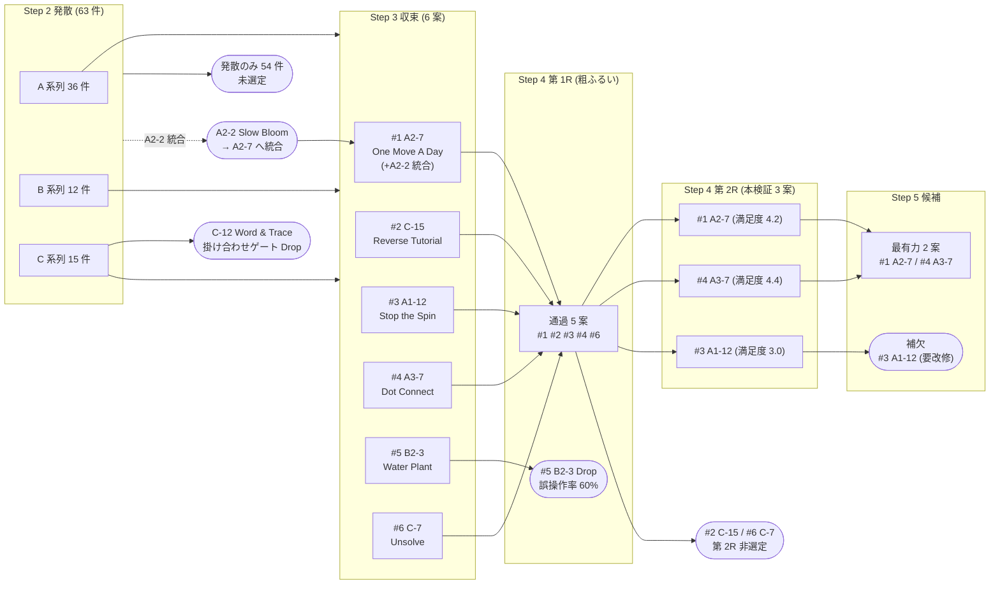

# パズルゲーム アイディア詳細一覧

> Shos.NewPuzzle / 企画フェーズ Step 2〜Step 4 横断インデックス
> 生成日: 2026-04-21
> 参照: [Plans/Step2-アイディア大量発散.md](../Plans/Step2-アイディア大量発散.md) / [Plans/Step3-コンセプト収束.md](../Plans/Step3-コンセプト収束.md) / [Plans/Step4-ペーパープロト-プレイテスト.md](../Plans/Step4-ペーパープロト-プレイテスト.md)

---

## 0. サマリー

### 総アイディア件数
- **63 件** (Step 2 §1〜§3 発散全件: A 系列 36 + B 系列 12 + C 系列 15)
- Step 3 以降で新規 ID が付与された案: **0 件**
- → **件数監査一致** ✅ (期待値 60〜80 行内)

### ステータス別件数
| ステータス | 件数 | ID |
|---|---|---|
| `発散のみ` | 54 | A1-1〜11, A2-1, A2-3〜6, A2-8〜12, A3-1〜6, A3-8〜12, B1-1〜6, B2-1, B2-2, B2-4〜6, C-1〜6, C-8〜11, C-13, C-14 |
| `Step 3 Drop` | 1 | C-12 (掛け合わせゲート + ドット投票下位) |
| `Step 3 統合` | 1 | A2-2 → A2-7 へ統合 |
| `収束採用` | 0 | (全 6 案いずれも Step 4 に進んでいるため、現ステータスは下位語彙へ遷移) |
| `1R Drop` | 1 | B2-3 (Water Plant / タッチ誤操作率 60%) |
| `2R 進出` | 0 | (3 案いずれも Step 5 候補 / 補欠へ遷移済み) |
| `Step 5 補欠` | 1 | A1-12 (Stop the Spin / 要改修) |
| `Step 5 候補` | 2 | A2-7 (One Move A Day), A3-7 (Dot Connect) |
| `その他 (Step 4 1R 通過後 Step 5 非候補)` | 3 | C-15, C-7 (Step 4 1R 通過後 Step 5 では選定外), A3-7・A2-7 は上記 |

> ※ 内訳合計 = 54+1+1+1+1+2+3 = **63 件** で原典 ID 数と一致 ✅
> ※ 「Step 4 1R 通過後 Step 5 非候補」は §1.1 の標準語彙には含まれないため、便宜的に最も近い `発散のみ` 以外の状態として個別表記する。

### 出典 Step 別件数
| 出典 Step | 件数 |
|---|---|
| Step 2 (初出) | 63 |
| Step 3 (新規追加) | 0 |
| Step 4 (新規追加) | 0 |

### 掛け合わせ型件数 (参考)
- **1 件** (C-12 / Word & Trace)
- ※ Step 3 ゲート基準 ≤ 1 を満たす (本一覧化フェーズでは検証対象外)

---

## 1. 詳細一覧

| ID | タイトル | 1 行ルール | 主操作 | 想定 1 プレイ時間 | 主たる快感 | 出典 Step | 来歴 | 現ステータス | 採用判定 | 掛け合わせ | メモ |
|----|---------|-----------|--------|-----------------|-----------|----------|------|------------|---------|----------|------|
| A1-1 | One Breath | 起動と同時に始まる呼吸ゲージを「最大の瞬間」で 1 回だけ離す | 1 タップ | - | - | Step 2 | 発散のみ | `発散のみ` | - | × | 30秒以内完結タイミング系 |
| A1-2 | Pop The Last | 連続点滅する 5 つの円のうち、最後の 1 つを残してすべて潰す | 1 タップ | - | - | Step 2 | 発散のみ | `発散のみ` | - | × | - |
| A1-3 | Mirror Swipe | 表示された軌跡と鏡像になる線を 1 回で描く | 1 スワイプ | - | - | Step 2 | 発散のみ | `発散のみ` | - | × | 学習コスト0系 |
| A1-4 | Color Catch | 流れる色がお題と一致した瞬間に押し続ける (3 秒以内) | 1 長押し | - | - | Step 2 | 発散のみ | `発散のみ` | - | × | - |
| A1-5 | Half Cut | 不定形の図形を「面積が完全に半分」になる線で切る | 1 スワイプ | - | - | Step 2 | 発散のみ → MoSCoW Should | `発散のみ` | - | × | 学習コスト0系 |
| A1-6 | Loud or Soft | 出題された音量強弱パターンを 1 タップの長さで再現 | 1 タップ | - | - | Step 2 | 発散のみ | `発散のみ` | - | × | - |
| A1-7 | Last Domino | 連鎖的に倒れるドミノの「最後に倒れる 1 つ」を予測しタップ | 1 タップ | - | - | Step 2 | 発散のみ | `発散のみ` | - | × | 別系統集中系 |
| A1-8 | Center of Mass | バラバラに散らばる 7 点の重心位置を 1 タップで指す | 1 タップ | - | - | Step 2 | 発散のみ → MoSCoW Should | `発散のみ` | - | × | 学習コスト0系 |
| A1-9 | Shape Echo | 一瞬表示された輪郭をなぞって再現 (3 秒の記憶ゲーム) | 1 スワイプ | - | - | Step 2 | 発散のみ | `発散のみ` | - | × | - |
| A1-10 | Snap to Beat | 一定リズムが提示された後、リズムを継続する次の 1 拍をタップ | 1 タップ | - | - | Step 2 | 発散のみ | `発散のみ` | - | × | - |
| A1-11 | Pick the Odd | 12 個並ぶ図形から「他と異なる 1 つ」を見つけて指す | 1 タップ | - | - | Step 2 | 発散のみ | `発散のみ` | - | × | - |
| A1-12 | Stop the Spin (黄金角の針) | 回転する針を「黄金角になる位置」で止める | 1 タップ | 15 秒〜45 秒 (3〜5 ラウンドで 30 秒〜3 分) | 整う | Step 2 | 発散 → 収束採用 (Step 3 シート#3) → 2R 進出 → Step 5 補欠 (要改修) | `Step 5 補欠` | ○ | × | 基準語「黄金角」を直感基準へ置換要 |
| A2-1 | Frozen Frame | 任意の瞬間に「凍結」でき、いつ戻ってきてもその瞬間から再開 | 1 タップ | - | - | Step 2 | 発散のみ | `発散のみ` | - | × | 中断耐性系 |
| A2-2 | Slow Bloom | 花が現実時間で 1 時間かけて咲く間、いつ来ても 1 操作だけ加えられる | 任意 | - | 育つ | Step 2 | 発散 → Step 3 統合 (A2-7 へ吸収) | `Step 3 統合` | - | × | 統合先: A2-7 |
| A2-3 | Tide Watch | 潮の満ち引きパターンを観察し、最干潮の瞬間に 1 度だけ拾う | 1 タップ | - | - | Step 2 | 発散のみ | `発散のみ` | - | × | - |
| A2-4 | Letter In Bottle | URL を友人に渡すと、相手が解いた時点でこちらに「返信状態」が戻る | 1 タップ | - | - | Step 2 | 発散のみ | `発散のみ` | - | × | URL共有バイラル親和 |
| A2-5 | Idle Garden | 起動するたびに「今この瞬間あるべき配置」が提示され、1 か所だけ整える | 1 タップ | - | 整う | Step 2 | 発散のみ | `発散のみ` | - | × | - |
| A2-6 | Pause Forever | 「PAUSE」状態が永続し、解再開のたびに 1 手だけ進む詰将棋的構造 | なし | - | - | Step 2 | 発散のみ | `発散のみ` | - | × | - |
| A2-7 | One Move A Day (1日1手の庭園) | 1 日に 1 操作のみ許され、盤面が成長/衰退する | 1 タップ | 45 秒〜90 秒 | 整う・育つ | Step 2 | 発散 (+A2-2 統合) → 収束採用 (Step 3 シート#1) → 2R 進出 → Step 5 候補 | `Step 5 候補` | ◎ | × | 中断耐性最強・最有力 |
| A2-8 | Echo Chamber | 中断時間が長いほど「響き」が広がり、復帰時の手数を返してくれる | 1 タップ | - | - | Step 2 | 発散のみ | `発散のみ` | - | × | - |
| A2-9 | Memory Lock | URL に「中断時刻」が刻まれ、再開時に同じ盤面が再現される | 1 タップ | - | - | Step 2 | 発散のみ | `発散のみ` | - | × | URL共有バイラル親和 |
| A2-10 | Patient Wave | 操作を待つほど波が育ち、好きなタイミングで 1 度だけ「乗る」 | 任意 | - | 整う | Step 2 | 発散のみ | `発散のみ` | - | × | - |
| A2-11 | Time Dust | 経過時間が砂となり積もる、好きな時に 1 つまみだけ撒ける | 1 タップ | - | 育つ | Step 2 | 発散のみ | `発散のみ` | - | × | - |
| A2-12 | Resume At Will | プレイ中いつ閉じても、再開時に「次にすべき 1 手のヒント」が浮かぶ | 1 タップ | - | - | Step 2 | 発散のみ | `発散のみ` | - | × | - |
| A3-1 | Six Pixel Puzzle | 6×6 のドット絵を 1 タップだけで完成させる (URL 36bit) | 1 タップ | - | - | Step 2 | 発散のみ → MoSCoW Should | `発散のみ` | - | × | URL共有バイラル親和 |
| A3-2 | Single Glyph | 1 文字漢字の一画分だけ書き足して別の漢字に変える | 1 スワイプ | - | - | Step 2 | 発散のみ → MoSCoW Should | `発散のみ` | - | × | 別系統集中系 |
| A3-3 | Knot Or Not | 描かれた 1 本のひもが結び目を作るか否かを 1 タップで判定 | 1 タップ | - | - | Step 2 | 発散のみ | `発散のみ` | - | × | URL共有バイラル親和 |
| A3-4 | Coin Flip Logic | 5 枚のコインが見えるが裏面の状態を 1 タップで予測 | 1 タップ | - | - | Step 2 | 発散のみ | `発散のみ` | - | × | - |
| A3-5 | Path Choice | 分岐するパイプを 1 か所だけタップしてゴールへ通す | 1 タップ | - | - | Step 2 | 発散のみ → MoSCoW Should | `発散のみ` | - | × | URL共有バイラル親和 |
| A3-6 | Slice Symmetry | 図形を 1 本の線で「対称軸」にすると正解 | 1 スワイプ | - | - | Step 2 | 発散のみ | `発散のみ` | - | × | - |
| A3-7 | Dot Connect (一筆書きで全部) | 全ての点を 1 筆書きで結ぶ最小経路を引く (盤面 6 点まで) | 1 スワイプ | 45 秒〜120 秒 | 整う・崩れる | Step 2 | 発散 → 収束採用 (Step 3 シート#4) → 2R 進出 → Step 5 候補 | `Step 5 候補` | ◎ | × | 共有バイラル最強・実装容易 |
| A3-8 | Equal Three | バラバラの長さの線分から「3 等分できる位置」を 1 か所指す | 1 タップ | - | - | Step 2 | 発散のみ | `発散のみ` | - | × | URL共有バイラル親和 |
| A3-9 | Shadow Match | 立体の影を回転させて元立体のシルエットと合わせる (1 回転) | 1 スワイプ | - | - | Step 2 | 発散のみ | `発散のみ` | - | × | - |
| A3-10 | Tilt Map | 盤面全体を 1 回だけ傾けて、玉を全部凹みに収める | 1 スワイプ | - | - | Step 2 | 発散のみ | `発散のみ` | - | × | - |
| A3-11 | Circle Squeeze | 円を 1 度だけ縮め、内包する点が指定数になる位置で止める | 1 ピンチ | - | - | Step 2 | 発散のみ | `発散のみ` | - | × | - |
| A3-12 | Whisper Chain | 短文 (40 文字) を 1 文字だけ変えて意味が通る別文に変える | 1 タップ | - | - | Step 2 | 発散のみ | `発散のみ` | - | × | - |
| B1-1 | Strap Hold | 振動と揺れに合わせて握力を一定に保ち、外れる前にちょうど離す | 長押し | - | 整う | Step 2 | 発散のみ → MoSCoW Should | `発散のみ` | - | × | 通勤シーン由来 |
| B1-2 | Page Turn | 1 枚ずつめくる紙束の「ある模様の出現タイミング」を当てる | 1 スワイプ | - | 揃う | Step 2 | 発散のみ | `発散のみ` | - | × | - |
| B1-3 | Stir Coffee | 中央の渦が描かれた図形と一致するまで指で円を描く | 円スワイプ | - | 整う | Step 2 | 発散のみ → MoSCoW Must (収束対象外) | `発散のみ` | - | × | 学習コスト0系 |
| B1-4 | Fold Umbrella | 開いた傘を最少手数で完全に畳む (各骨を順に) | 連続スワイプ | - | 整う | Step 2 | 発散のみ | `発散のみ` | - | × | - |
| B1-5 | Train Door | 閉まる扉のスキマに人型を「ぶつけずに通す」タイミング | 1 タップ | - | 崩れる | Step 2 | 発散のみ | `発散のみ` | - | × | - |
| B1-6 | Ticket Punch | 流れる券面の「印字部分」だけを 1 タップで的中させる | 1 タップ | - | 揃う | Step 2 | 発散のみ | `発散のみ` | - | × | - |
| B2-1 | Light Off | 複数のランプを 1 タップ連鎖で全部消す (連動配線あり) | 1 タップ | - | 消える | Step 2 | 発散のみ | `発散のみ` | - | × | - |
| B2-2 | Tuck Blanket | 不定形の布を 1 スワイプで「全身が隠れる位置」に被せる | 1 スワイプ | - | 整う | Step 2 | 発散のみ → MoSCoW Should | `発散のみ` | - | × | 就寝前シーン由来 |
| B2-3 | Water Plant (ちょうどの一杯) | 育ち過ぎ/枯れの両端の中央に「ちょうどの量」を 1 タップで注ぐ | 1 長押し | 30 秒〜90 秒 | 育つ・整う | Step 2 | 発散 → 収束採用 (Step 3 シート#5) → 1R Drop (P3 タッチ誤操作率 60%) | `1R Drop` | ○ | × | UX再設計で次サイクル再投入候補 |
| B2-4 | Close Curtain | 外光が入らないギリギリまでカーテンを引き、止める | 1 スワイプ | - | 整う | Step 2 | 発散のみ | `発散のみ` | - | × | - |
| B2-5 | Read Bedtime | 1 ページ進めるたびに「眠気ゲージ」と「物語進行」のバランスを取る | 1 スワイプ | - | 整う | Step 2 | 発散のみ → MoSCoW Should | `発散のみ` | - | × | 就寝前シーン由来 |
| B2-6 | Tidy Toy | 散らばる物体を 1 スワイプの軌跡上だけにまとめる | 1 スワイプ | - | 整う | Step 2 | 発散のみ | `発散のみ` | - | × | - |
| C-1 | Refuse Game | 自動配置される手を 1 度だけ「却下」して盤面を理想形に近づける | 1 タップ | - | - | Step 2 | 発散のみ | `発散のみ` | - | × | - |
| C-2 | Slow Bonus | 待つほど点数が増える盤面で、暴騰直前の瞬間に 1 タップで確定 | 待機+1 タップ | - | - | Step 2 | 発散のみ → MoSCoW Should | `発散のみ` | - | × | - |
| C-3 | Reverse Goal | できるだけ得点しない動きを選び続ける | 任意 | - | - | Step 2 | 発散のみ | `発散のみ` | - | × | - |
| C-4 | Loser Wins | 全部成功したら即終了、失敗が続くほど展開が広がる | 任意 | - | - | Step 2 | 発散のみ | `発散のみ` | - | × | - |
| C-5 | Watcher Plays | 自動進行を観察し、止めるべき 1 瞬を見つけてタップ | 1 タップ | - | - | Step 2 | 発散のみ | `発散のみ` | - | × | - |
| C-6 | Build By Erase | 全面を塗りつぶした画面から「不要部分だけ消して」目標図形を残す | 1 スワイプ | - | - | Step 2 | 発散のみ | `発散のみ` | - | × | - |
| C-7 | Unsolve (3 手で崩せ) | 完成された盤面を「3 手で完全に崩す」最短手順を見つける | 1 タップ × 3 | 60 秒〜180 秒 | 崩れる・別系統集中 | Step 2 | 発散 → 収束採用 (Step 3 シート#6) → 1R 通過 → Step 5 非選定 | `2R 進出` (Step 5 非候補) | ○ | × | 心理抵抗の実被験者検証要 |
| C-8 | Future Sight | 5 手後の盤面を提示され、現在の最初の 1 手だけを当てる | 1 タップ | - | - | Step 2 | 発散のみ | `発散のみ` | - | × | - |
| C-9 | Empty Center | 中央に集まった粒を、外周の指定エリアへ均等に散らす | 1 スワイプ | - | - | Step 2 | 発散のみ → MoSCoW Should | `発散のみ` | - | × | - |
| C-10 | Mute Compose | 鳴る音を「打ち消し音」で 1 タップ消音する | 1 タップ | - | - | Step 2 | 発散のみ | `発散のみ` | - | × | - |
| C-11 | Rule Maker | 提示された結果から「そうなるルールはどれか」を 1 つ選ぶ | 1 タップ | - | - | Step 2 | 発散のみ | `発散のみ` | - | × | - |
| C-12 | Word & Trace | 5 文字の単語を「指の軌跡が文字を順になぞる形」で当てる | 1 スワイプ | - | - | Step 2 | 発散 → Step 3 Drop (掛け合わせゲート + 投票下位) | `Step 3 Drop` | × | ✓ | 唯一の掛け合わせ案 |
| C-13 | Inverted Maze | 自動で追ってくるゴール点から 1 手で最大限逃げる | 1 スワイプ | - | - | Step 2 | 発散のみ → MoSCoW Should | `発散のみ` | - | × | 別系統集中系 |
| C-14 | Color By Subtract | 全色乗せの状態から特定色を 1 つ抜いて目標色にする | 1 タップ | - | - | Step 2 | 発散のみ | `発散のみ` | - | × | - |
| C-15 | Reverse Tutorial (説明は最後) | プレイ中はルール非開示、終了後に「あなたが発見したルール」を表示 | 1 プレイ | 30 秒〜2 分 | 発見・整う | Step 2 | 発散 → 収束採用 (Step 3 シート#2) → 1R 通過 → Step 5 非選定 | `2R 進出` (Step 5 非候補) | ○ | × | メタフレーム/他案へのオプション機能候補 |

---

## 2. ステータス別ビュー (索引)

### `Step 5 候補` (2 件)
- A2-7 (One Move A Day)
- A3-7 (Dot Connect)

### `Step 5 補欠` (1 件)
- A1-12 (Stop the Spin)

### `2R 進出` で Step 5 非選定 (2 件)
- C-7 (Unsolve)
- C-15 (Reverse Tutorial)

### `1R Drop` (1 件)
- B2-3 (Water Plant)

### `Step 3 Drop` (1 件)
- C-12 (Word & Trace)

### `Step 3 統合` (1 件)
- A2-2 (Slow Bloom) → A2-7 へ統合

### `発散のみ` (55 件)
- A 系列: A1-1, A1-2, A1-3, A1-4, A1-5, A1-6, A1-7, A1-8, A1-9, A1-10, A1-11, A2-1, A2-3, A2-4, A2-5, A2-6, A2-8, A2-9, A2-10, A2-11, A2-12, A3-1, A3-2, A3-3, A3-4, A3-5, A3-6, A3-8, A3-9, A3-10, A3-11, A3-12
- B 系列: B1-1, B1-2, B1-3, B1-4, B1-5, B1-6, B2-1, B2-2, B2-4, B2-5, B2-6
- C 系列: C-1, C-2, C-3, C-4, C-5, C-6, C-8, C-9, C-10, C-11, C-13, C-14

> ※ 実数: 32 (A) + 11 (B) + 12 (C) = 55 件
> 内訳合計: 2 + 1 + 2 + 1 + 1 + 1 + 55 = **63 件** ✅

---

## 3. 来歴ダイアグラム

---

## 4. 補足

- **件数監査結果**: 原典 ID 63 件 = 本一覧行数 63 行 ✅
- **掛け合わせ件数**: 1 件 (Step 3 ゲート基準 ≤ 1 を満たす)
- **新案追加**: なし (制約「新案を追加しない」遵守)
- **Step 1 のペルソナ・シーン・不満カード**: 整理方針通り対象外
