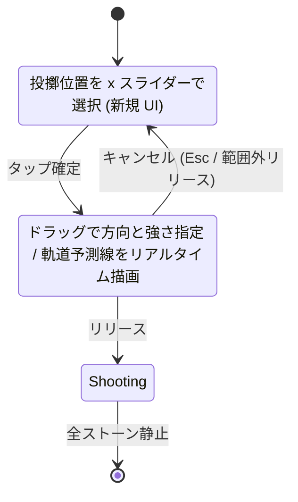
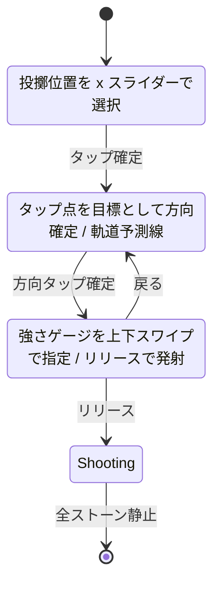
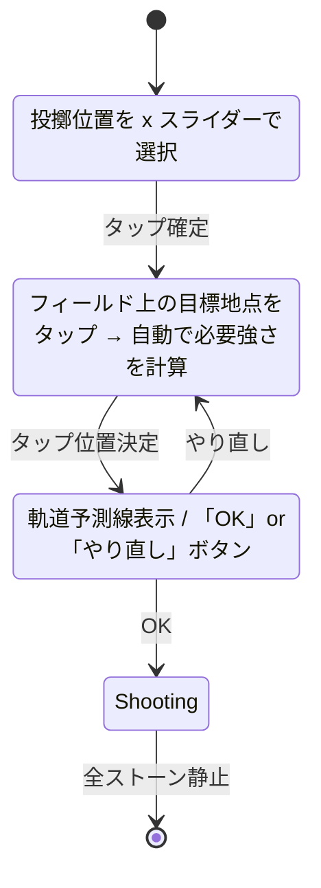
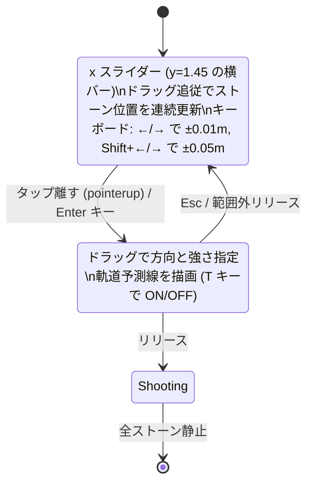

# 物理おはじき (Physical Ohajiki) v2 カーリング型ピボット 設計提案

> **位置づけ**: ブレストフェーズの設計提案ドキュメント (実装計画ではない)
> **入力プロンプト**: [.github/prompts/Physical Ohajiki — 仕様大幅変更.prompt.md](../.github/prompts/Physical%20Ohajiki%20%E2%80%94%20%E4%BB%95%E6%A7%98%E5%A4%A7%E5%B9%85%E5%A4%89%E6%9B%B4.prompt.md)
> **基準コミット**: `5182fd3` (Phase 1 / MVP-α / M1.8 完了 / 126 PASS)
> **作成日**: 2026-04-22
> **承認後の次工程**: `Plans/PhysicalOhajiki.開発計画.md` を v2 ピボット計画に書き換え (writing-plans セッション)
> **確定済み事前合意**: フィールド形状=縦長レーン (Q1=B) / エンド構造=2〜3 エンド制 (Q2=B) / UI 提示形式=テキスト+Mermaid のみ (Q3=A)

---

## §1 カーリング調査サマリ

### 1.1 公式ルール骨子 (引用)

主要出典:
- **[1] World Curling Federation, "The Rules of Curling and Rules of Competition" (Oct 2022)** — https://worldcurling.org/competitions/rules/
- **[2] Wikipedia 日本語版「カーリング」** — https://ja.wikipedia.org/wiki/%E3%82%AB%E3%83%BC%E3%83%AA%E3%83%B3%E3%82%B0
- **[3] Wikipedia 英語版 "Curling"** — https://en.wikipedia.org/wiki/Curling

| 項目 | カーリング標準 (出典) | 本作への含意 |
|---|---|---|
| シート寸法 | 45.0–45.7 m × 4.4–5.0 m / 縦長 ([3] §Equipment) | 縦長レーン採用 (Q1=B) と整合 |
| ハウス | 4 同心円 (直径 1/4/8/12 ft = 0.305/1.22/2.44/3.66 m) ([3]) | 4 リングを採用 (視覚的に「カーリングらしさ」) |
| ボタン (中心円) | 直径 1 ft / ティーは中心点 ([3]) | 最高難度ターゲットとして残す |
| 1 エンドの投球数 | 各チーム 8 投 (Mixed Doubles は 5–6 投) ([2][3]) | 短縮 (2〜4 投) を採用 |
| 試合エンド数 | 8 または 10 エンド ([2]) / Tour で 8 が主流 ([3]) | 2〜3 エンドへ大幅短縮 |
| ハンマー権 (last rock) | 後攻有利 / 試合開始は LSD or コイントス / 非得点側が次エンドのハンマー獲得 / ブランクエンドはハンマー保持 ([3] Hammer) | 採用するが LSD は省略 (コイントス相当) |
| フリーガードゾーン (FGZ) | ホッグライン〜ティーライン間でハウス外。最初の 5 投 (5-rock rule, 2018–19〜) はガード除去禁止 ([3] Free guard zone) | 投球数が少ないため 1–2-rock rule へ簡略化 |
| スコアリング | エンド終了時、ハウス内の最近接ストーンを持つ側のみ得点。「相手最近接ストーンより内側にある自陣ストーン数」=得点。1 エンド最大 8 点 ([3] Scoring / [2]) | 完全踏襲。本作は「最大 4 点」など投球数依存で再算出 |
| 場外判定 | バックライン超過 / サイドライン接触 / ホッグライン未到達 → 失格除去 ([2]) | 「フィールド外消滅」は現行と整合 |
| 同点処理 | エキストラエンド (延長) ([2]) | 採用 (1 エキストラ実装、二重同点は引き分け) |
| 投擲方向 | 全員が同方向 (ハック→ハウス) ([3]) | 片方向投球 (Q1=B) と整合 |
| ストーン回転 (カール) | 投擲時の回転で曲がる軌道 ([3]) | **本作では採用しない** (操作複雑度を抑制 / 第 3 エンドからの拡張枠と位置づけ) |
| スウィーピング | 軌道延長・カール抑制 ([3] Sweeping) | **本作では採用しない** (1 人プレイでは原理的に不可 / G7 学習コスト保護) |

### 1.2 採用 / 簡略化マトリクス

| カーリング要素 | 本作での扱い | 理由 |
|---|---|---|
| ハウス (4 同心円) | ✅ 採用 (寸法縮小) | 視覚的に「カーリングらしさ」を保つ最重要要素 |
| ティー (中心) と最近接判定 | ✅ 完全踏襲 | 得点ルールの根幹 |
| エンド制 / 投球順 | ✅ 採用 (2〜3 エンド × 各 3〜4 投) | 戦略性の核 |
| ハンマー権 | ✅ 採用 (簡略 LSD 省略 / コイントス相当) | 戦略性とテンポを両立 |
| FGZ ルール | ✅ 簡略採用 (1〜2-rock rule) | テイクアウト一辺倒の回避 |
| 同点処理 | ✅ エキストラエンド 1 回 / なお同点は引き分け | カジュアル試合長維持 |
| 場外判定 | ✅ 採用 (現行ロジック流用) | 既存 `rules.js` 流用可能 |
| ハウス内のみ得点 | ✅ 採用 | 「外周外」を明示することで戦略的引き締め |
| ストーン回転 (カール) | ❌ 不採用 (将来拡張余地) | G7 (15 秒以内に最初の有効操作) を保護 / 物理モデルが線形でなくなる |
| スウィーピング | ❌ 不採用 | 1 人プレイ前提で実現困難 / UI の負担増 |
| チーム構成 (リード〜スキップ) | ❌ 不採用 | 1 人 vs 1 人前提 |
| LSD (Last Stone Draw) | ❌ 不採用 | 開始テンポ優先 / コイントスに置換 |

---

## §2 新ルール仕様

### 2.1 フィールド (縦長レーン)

```
            [対面側 = ハウス側]
       ┌──────────────────┐  y = 0.0 (バックライン)
       │      [ハウス]      │
       │   ┌─────────┐    │  ハウス中心 (=ティー): (0.25, 0.20)
       │   │  4 同心円  │    │  ボタン r = 0.020 m
       │   │           │    │  リング 1 r = 0.040 m
       │   └─────────┘    │  リング 2 r = 0.070 m
       │                    │  リング 3 r = 0.100 m (=「ハウス外周」)
       │                    │
       │     [FGZ]          │  y = 0.30 〜 0.40 (FGZ 帯)
       │ - - - - - - - - - -│  y = 0.40 (ホッグライン / ストーン到達必須)
       │                    │
       │       (走路)        │
       │                    │
       │                    │
       │ - - - - - - - - - -│  y = 1.40 (ハック前方ライン)
       │      [投擲位置]    │  y = 1.45 (固定 / x は 0.05〜0.45 から選択)
       └──────────────────┘  y = 1.50 (バックライン手前 = プレイヤー側)
            幅 0.5 m
```

**寸法 (確定値の提案)**:

| 要素 | 値 | 根拠 |
|---|---|---|
| レーン幅 W | **0.5 m** | モバイル縦持ち 9:16 比に整合 (1:3) |
| レーン長 L | **1.5 m** | カーリング 1:10 比からは短縮、カジュアル戦に最適化 |
| ハウス中心 | (0.25, 0.20) | 対面側から 0.20 m 内側 |
| ハウス外周半径 | **0.10 m** | レーン幅の 40% (`min(W,L)/5` ≒ 0.10) |
| ボタン半径 | **0.020 m** | 球半径 r=0.02 と同径 (1 球が「ボタン on」を満たす最小サイズ) |
| ホッグライン | y = **0.40** | 球がここを越えないと無効 (場外と同じ扱い) |
| 投擲位置 | y = **1.45**, x ∈ [0.05, 0.45] | プレイヤー側からの固定発射ライン |

**球半径**: r = **0.020 m** (現行 §3.2 と同値、変更なし)。球数が 1 エンド最大 8 個になるためハウス内の混雑度は現行 (10〜20 球) より緩和。

### 2.2 エンド構造 / 投球数

**推奨案: 2 エンド × 各プレイヤー 4 投 = 1 試合合計 16 投**

| 項目 | 値 | 根拠 |
|---|---|---|
| エンド数 | **2** | カーリング Mixed Doubles (8 エンド) を 1/4 に圧縮 / G3/G4 達成のため |
| 1 エンド内の各プレイヤー投球数 | **4** | カーリング Mixed Doubles の半分 (5–6 → 4) |
| 1 試合の総投球数 | 16 (= 2 × 4 × 2) | — |
| 投球順 | 各エンド内で先攻・後攻が 1 球ずつ交互 | カーリング標準 |
| ハンマー権 | 1st エンド = ランダム / 2nd エンド = 前エンド非得点側 / ブランクエンド = ハンマー保持 | カーリング標準 |
| エキストラエンド | 同点時のみ 1 エンド (4+4 投) | 二重同点は引き分け |

**1 試合時間試算**:
- 1 投の所要 ≒ (照準 6 秒 + シミュ 3 秒) = 9 秒
- 通常 16 投 × 9 秒 = **144 秒 ≒ 2 分 24 秒**
- エキストラ込み最悪 24 投 × 9 秒 = 216 秒 ≒ **3 分 36 秒**

**G3 (10 球モード ≤ 3 分) / G4 (6 球モード ≤ 1.5 分) との関係**:
- 現行 G3/G4 はそのままでは適用不可 (球数モードの概念が無くなる)。
- **本作 v2 用に新ゴール定義を提案**:
  - **G3'**: 通常戦 (2 ends) 中央値 ≤ **3 分** (旧 G3 と同水準を維持)
  - **G4'**: 短縮戦 (1 end) 中央値 ≤ **1.5 分** (旧 G4 と同水準を維持)
  - 短縮戦 (1 end) は P1 Mobile 通勤層向けに残す

### 2.3 得点計算

```
score(player) = count{
  stone ∈ player.stones |
    stone is in house  AND
    distance(stone.center, tee) <
    min{ distance(opp.center, tee) | opp ∈ opponent.stones if opp is in house }
}
```

- 「ハウス内」: 球の中心が外周半径 0.10 m 以内 (**球の縁ではなく中心で判定** — 円-円接触判定の単純化)
- 相手のハウス内ストーンが 0 個の場合、**自陣ハウス内ストーン数全部が得点**
- 両者ハウス内ストーン 0 → ブランクエンド (得点 0 / ハンマー保持)
- 1 エンド最大得点 = **4 点** (全自陣ストーンがボタン側に固まった場合)

### 2.4 場外 / ホッグライン

- 球の中心が y < 0 (バックライン超過) → 失格除去
- 球の中心が x < 0 または x > W (サイドライン超過) → 失格除去
- ストーン静止時に y > 0.40 (ホッグライン未到達) → 失格除去
- 失格除去判定は **すべてのストーンが静止した後** に一括実行 (現行 `rules.isOutOfBounds` を拡張)

### 2.5 FGZ (フリーガードゾーン) ルール

- FGZ = ホッグライン (y=0.40) 〜 ハウス外周 (y=0.30) の帯 + ハウス外側の側方
  - 簡略化: **「y ∈ [0.30, 0.40] かつ ハウス外」** を FGZ と定義
- **1-rock rule (簡略採用)**: 各エンドの **最初の 2 投** (先攻 1 投目 + 後攻 1 投目) において、相手のガードストーン (FGZ 内) を **場外へ弾き出してはならない**
  - 違反した場合: 弾き出されたストーンを元位置に戻し、投げたストーンを除去
- カーリング標準 5-rock より大幅簡略 (投球数自体が少ないため)

### 2.6 同点処理

- 2 エンド終了時に同点 → エキストラエンド (各 4 投) 1 回
- エキストラエンドも同点 → **引き分け** (記録 / URL シードでも判定可能)

### 2.7 1 ターン制限時間 (現行 `thinkDeadlineMs` 維持方針)

- 1 投あたり配置 + 照準合計 **10 秒上限** (現行と同値)
- 超過時は自動キャンセル (再操作可)

---

## §3 新物理モデル

### 3.1 params 変更点

| パラメータ | v1 既定値 | v2 既定値 | 変更内容 |
|---|---|---|---|
| ρ (密度) | 1.0 | 1.0 | 維持 |
| r (球半径) | 0.02 | 0.02 | 維持 |
| **G (万有引力)** | 1e-3 / 0 / 5e-3 (3 モード) | **削除** | 完全廃止 (確定済) |
| e (反発係数) | 0.85 | 0.85 | 維持 |
| μ (動摩擦係数) | 0.3 | 0.3 | 維持 |
| **W (フィールド幅)** | 1.0 | **0.5** | レーン幅へ縮小 |
| **L (フィールド高さ)** | 1.0 | **1.5** | レーン長へ拡大 |
| **house** (新規) | — | `{cx: 0.25, cy: 0.20, radii: [0.020, 0.040, 0.070, 0.100]}` | ハウス中心 + 4 リング半径 |
| **hogLine** (新規) | — | `0.40` | ホッグライン y 座標 |
| **launchY** (新規) | — | `1.45` | 投擲位置 y |
| **launchXRange** (新規) | — | `[0.05, 0.45]` | 投擲位置 x の選択範囲 |

### 3.2 削除モジュール / コードパス

| モジュール | 状態 | 備考 |
|---|---|---|
| `src/physics/gravity.js` | **完全削除** | `applyGravity` 関数とテスト |
| `tests/unit/gravity.test.js` | **完全削除** | 6 テスト除去 |
| `src/physics/engine.js` の `applyGravity()` 呼出 | **削除** | `step()` 内のループから除去 |
| `src/game/state.js` の `gravityMode` フィールド | **削除** | モード概念消失 |
| `src/game/state.js` の `mode: '10ball' | '6ball'` | **再定義** | `mode: '2end' | '1end'` に変更 |
| `src/game/rules.js` の残数勝敗判定 | **完全置換** | 上記 §2.3 のスコアリングロジックに置換 |
| `src/game/rules.js` のタイブレーク (中心距離合計) | **完全置換** | エキストラエンド + 引き分けに置換 |
| 「自陣領域の複数球初期配置」 (`createInitialState` のリジェクションサンプリング) | **削除** | エンド開始時はストーン 0 個 |

### 3.3 既知問題 (M1.2 R1) の解消

- G=1e-3 で `runUntilRest` が 4 秒タイムアウトする問題 → **G 廃止により自然解消** (摩擦のみで停止が確実に発生)
- `tests/unit/determinism.test.js` の引力依存スナップショットは **再生成または除却**

---

## §4 UI 改良案 (3 案比較 + 推奨)

### 4.1 共通要件 (全案に適用)

- 二層構成 (純粋 FSM / DOM アダプタ) は維持 — 現行 `pointer.js` の構造再利用
- 入力共通インタフェース (`onPlace / onAimAdjust / onShoot / onCancel`) は維持
- `keyboard.js` (アクセシビリティ) は **全案で併存必須**

### 4.2 案 A: 軌道予測線付きスリングショット (現行 + 視覚補強)



| 評価軸 | 評価 |
|---|---|
| 学習コスト (G7 ≤15 秒) | ◎ — 現行 UX を継承、軌道線で予測しやすい |
| アクセシビリティ (キーボード併存) | ◎ — 現行 `keyboard.js` 4 状態 FSM を流用可能 |
| 実装難易度 | △ — 軌道予測線は摩擦込みの数値積分が必要 (描画コスト) |
| 既存類似ゲーム | Angry Birds / おなじみのスリングショット |
| 現 `pointer.js` 差分 | 小 (FSM 流用 / 軌道描画ロジック追加) |

### 4.3 案 B: Aim-then-Power (狙う→強さの 2 ステップ)



| 評価軸 | 評価 |
|---|---|
| 学習コスト (G7 ≤15 秒) | △ — 2 ステップで操作量増 / チュートリアル文字数も増 |
| アクセシビリティ | ○ — キーボードは 5 状態 FSM へ拡張 |
| 実装難易度 | 中 — 状態数増加 / ゲージ UI 新規実装 |
| 既存類似ゲーム | Wii Sports カーリング / モバイルゴルフゲーム |
| 現 `pointer.js` 差分 | 中 |

### 4.4 案 C: Direct Touch-Target (目的地タップ)



| 評価軸 | 評価 |
|---|---|
| 学習コスト (G7 ≤15 秒) | ◎ — 「ここに止めたい」が直感的 |
| アクセシビリティ | △ — 「目標地点」のキーボード指定は現状の 24 方位より複雑 |
| 実装難易度 | 大 — 強さ逆算ロジック (摩擦込み逆問題) が必要 / 障害物 (他球) があると逆算困難 |
| 既存類似ゲーム | カーレット (千葉大学発) / 一部のモバイルカーリング |
| 現 `pointer.js` 差分 | 大 — FSM 全面書き換え / 物理逆問題ソルバー新規実装 |

### 4.5 推奨: **案 A (軌道予測線付きスリングショット)** ✅ **採用確定 (2026-04-22)**

**理由 (3 点)**:

1. **学習コスト最小**: 現行 UX (引いて離す) を継承するため、Phase 1 のテスタが既に習熟しているチュートリアル文 (24 文字) を **「指で引いて離す。線を読んで的に近づけて勝つ。」(28 文字)** へ微修正するだけで済む。G7 (≤15 秒) を確実に守れる。
2. **実装コスト最小**: 既存 `pointer.js` の 4 状態 FSM (placing → aiming → aiming-power → idle) と `keyboard.js` をそのまま流用可能。新規追加は **軌道予測線の描画ロジック (摩擦込み数値積分)** のみ。
3. **W4 (操作精密度) への対応**: 評価書 W4 で指摘された「引きスリングショットは指の精度に依存」の弱点を、軌道線の視覚フィードバックで緩和できる。誤操作率 G8 (≤30%) の改善余地がある。

### 4.6 案 A 詳細仕様 (ユーザー回答 2026-04-22 反映)

| 項目 | 確定仕様 | 備考 |
|---|---|---|
| **A-1: 投擲位置選択 UI 形態** | **ドラッグで連続調整** | placing 段でレーン下端 (y=1.45) の x スライダーをドラッグ追従。タップ確定で aiming へ遷移。キーボードは `←`/`→` で 0.01 m 単位、`Shift+←/→` で 0.05 m 単位 (`keyboard.js` 既存 24 方位入力の placing 段拡張) |
| **A-2: 軌道予測線の精度 (MVP)** | **他球無視・摩擦のみの自由飛行軌道** | semi-implicit Euler を `engine.step` のサブセット (衝突判定なし版) で再利用。固定ステップ (例: dt=1/120) で N ステップ分先読みし、`Path2D` でストロークレンダリング。完全実装 (一次衝突予測) は §5.1 完全段で対応 |
| **A-3: 軌道予測線の ON/OFF 切替** | **設定で消せるオプションを設ける** | 既定 ON。HUD 設定パネル (新規) のチェックボックス + キーボードショートカット (例: `T` キー) でトグル。設定値は `localStorage` に保存 (依存ゼロ原則維持) |

#### A-1 詳細: 投擲位置選択フロー (Mermaid)



#### A-2 詳細: 軌道予測線アルゴリズム (MVP)

```
input: (x0, y0) = ストーン初期位置
       (vx0, vy0) = 引き距離から計算した初速ベクトル
       params.μ (動摩擦係数)
output: ポリライン頂点列 [(x_i, y_i)]_{i=0..N}

t = 0
while |v| > vEps and i < N_MAX:
    a = -μ * |v| * v_normalized        # 摩擦による減速
    v += a * dt                         # semi-implicit Euler
    pos += v * dt
    if pos が壁 / ホッグライン外 / バックライン外:
        break
    点列に pos を追加
    i++
```

- **計算量**: 1 投あたり最大 200 ステップ程度 (停止まで <2 秒 / dt=1/120)。60fps の描画フレーム内で完了する見積もり。
- **描画**: 半透明の白破線 (`rgba(255,255,255,0.5)` / `setLineDash([4, 4])`)。配色 §M0.4 とのコントラスト確認は §7 R6 と統合。

#### A-3 詳細: 設定保存仕様

| 項目 | 値 |
|---|---|
| 保存先 | `localStorage` キー `physicalOhajiki.v2.settings` |
| 形式 | JSON: `{ aimPreview: boolean, ... }` |
| 既定値 | `aimPreview: true` |
| 設定 UI | HUD 上部に歯車アイコン → チェックボックス 1 個 (MVP-α 段階) |
| キーボードショートカット | `T` キー (Toggle Trajectory) で即時切替 |
| 保存タイミング | 切替操作の度に即時 `setItem` |

> **影響**: §6 影響範囲マトリクスに `src/render/ui.js` (設定パネル新規) と `src/main.js` (起動時 `localStorage` ロード) の改修を追加 (§6 既掲載と整合)。テスト追加: `tests/unit/settings.test.js` (新規 / 3 件想定 — load/save/default)。

---

## §5 追加ゲーム性提案 (3〜5 個)

各提案は **MVP (最小実装) / 完全実装 (将来拡張)** の 2 段階に分割。WBS 化を容易にする。

### 5.0 採否確定マトリクス (2026-04-22 ユーザー承認: B 採用)

| # | 提案 | MVP-α | MVP-β (Phase 2v2) | 将来拡張 |
|---|---|---|---|---|
| 5.1 | 軌道予測線 | ✅ MVP (A-2 で確定) | 完全 (一次衝突予測) | — |
| 5.2 | パワーゲージ可視化 | ✅ MVP | — | 完全 (平均マーカー) |
| 5.3 | ハウス内距離リング | ✅ MVP | 完全 (動的距離線) | — |
| 5.4 | ハンマー / 先攻・後攻 HUD | ✅ MVP | — | 完全 (戦略ヒント) |
| 5.5 | リプレイ / シェア | — | ✅ MVP (URL シード共有) | 完全 (フルログ視聴) |

**MVP-α 合計**: 5.1 MVP + 5.2 MVP + 5.3 MVP + 5.4 MVP ≒ **約 2.5 日相当** (M+S+S+S)
**MVP-β 合計**: 5.5 MVP + 5.1 完全 + 5.3 完全 ≒ **約 3.5 日相当** (S+L+M)


### 5.1 軌道予測線 (Aim Trajectory Preview) — **必須相当**

| 段階 | 内容 | 想定タスクサイズ |
|---|---|---|
| MVP | 摩擦のみ (他球無視) の自由飛行軌道を **薄い破線** で描画 / 引き照準中のみ表示 | M (1 日相当) |
| 完全 | 他球との一次衝突予測まで含めた軌道線 / 衝突点でのストーン挙動矢印 | L (2 日相当) |

**理由**: §4 推奨案 A の前提機能 / W4 (操作精密度) 改善の主軸。

### 5.2 パワーゲージ可視化 (Power Gauge HUD)

| 段階 | 内容 | 想定タスクサイズ |
|---|---|---|
| MVP | 引き距離に比例した縦バーを HUD 右に表示 / 最大 = 赤、適正 = 緑 | S (半日相当) |
| 完全 | 過去ショットの平均パワーを薄色のマーカーで重ね表示 / プレイヤー学習補助 | M (1 日相当) |

**理由**: 「どれくらい引いたか分からない」というカジュアル層の不安を解消。

### 5.3 ハウス内距離リング (Real-time Score Preview)

| 段階 | 内容 | 想定タスクサイズ |
|---|---|---|
| MVP | エンド進行中、ハウス内ストーンに「現在何点取得中」のバッジを重畳表示 | S |
| 完全 | 各ストーンからティーへの距離を細い線で動的描画 / ナンバーワンストーンを強調 | M |

**理由**: カーリング初心者が得点ルールを直感理解する補助 / 戦略性の可視化。

### 5.4 ハンマー / 先攻・後攻アイコン (Turn-Order HUD)

| 段階 | 内容 | 想定タスクサイズ |
|---|---|---|
| MVP | 現エンドのハンマー保持側を HUD 上部にアイコンで明示 / 投球順 (1/4, 2/4 ...) を表示 | S |
| 完全 | 「ハンマー権を取り戻す」戦略のヒント (ブランクエンド狙いなど) を文字で軽く表示 | M |

**理由**: ハンマー権の重要性が初心者にとって直感的でない (W2 リスク緩和)。

### 5.5 リプレイ / シェア (Replay & Share)

| 段階 | 内容 | 想定タスクサイズ |
|---|---|---|
| MVP | 試合終了後、URL シードを「結果共有用 URL」としてコピー可能にする (現行 v1 設計の流用) | S |
| 完全 | 全投球の (placeX, aimX, aimY) ログをエンコードし「他人がリプレイ視聴可能」 | L |

**理由**: 評価書 S4 (URL 非同期対戦) の継承 / カジュアル層のリテンション向上。

---

## §6 影響範囲マトリクス (現存 14 モジュール + テスト 13 ファイル)

### 6.1 `src/` モジュール (14 ファイル)

| モジュール | 行数 (現状) | 削除 / 改修 / 維持 | 主な変更点 |
|---|---|---|---|
| `src/main.js` | 202 | **改修 (大)** | レーン寸法 / 投擲位置 / エンド進行ロジックの再構成 |
| `src/audio/sfx.js` | 134 | **維持** | サウンド ID は流用 (click/pop/turn) |
| `src/game/state.js` | 213 | **改修 (大)** | `mode` 再定義 / `gravityMode` 削除 / `houseConfig` 追加 / `endIndex` / `hammerSide` |
| `src/game/rules.js` | 61 | **完全置換** | カーリング得点 / FGZ / エキストラエンド |
| `src/game/loop.js` | 91 | **改修 (中)** | `applyShot` のストーン生成位置を投擲ラインに固定 |
| `src/input/pointer.js` | 137 | **改修 (中)** | placing FSM を x スライダーへ変更 / 軌道予測線連携 |
| `src/input/keyboard.js` | 219 | **改修 (中)** | placing 段の操作を「x スライダー左右移動」に変更 |
| `src/physics/engine.js` | — | **改修 (小)** | `applyGravity` 呼出削除 / コールバックは維持 |
| `src/physics/collision.js` | — | **維持** | 円-円 / 円-壁衝突は流用 (壁寸法のみ params 経由) |
| `src/physics/gravity.js` | — | **完全削除** | — |
| `src/physics/rng.js` | — | **維持** | mulberry32 流用 |
| `src/render/canvas.js` | 117 | **改修 (中)** | 縦長レーン描画 / ハウス 4 同心円 / FGZ ハッチ / ホッグライン |
| `src/render/effects.js` | 132 | **維持** | ripple / popup / shake は流用 |
| `src/render/ui.js` | 90 | **改修 (大)** | HUD 全面再設計 (エンド表示 / ハンマー / 得点プレビュー) / TUTORIAL_TEXT 更新 |

**集計**: 維持 4 / 改修 (小) 1 / 改修 (中) 4 / 改修 (大) 4 / 完全置換 1 / 完全削除 1

### 6.2 `tests/unit/` テスト (13 ファイル / 126 PASS)

| テストファイル | 現状件数 | 削除 / 改修 / 維持 | 想定後件数 |
|---|---|---|---|
| `_smoke.test.js` | 3 | 維持 | 3 |
| `rng.test.js` | 4 | 維持 | 4 |
| `collision.test.js` | 10 | 維持 | 10 |
| `engine.test.js` | 15 | 改修 (gravity 関連除去) | 12 (-3) |
| `gravity.test.js` | 6 | **完全削除** | 0 (-6) |
| `determinism.test.js` | 3 | 改修 (引力依存スナップショット再生成) | 3 |
| `pointer.test.js` | 10 | 改修 (FSM 再定義) | 10 |
| `keyboard.test.js` | 14 | 改修 (placing 段再定義) | 14 |
| `state.test.js` | 15 | 改修 (mode/end/hammer 追加) | 18 (+3) |
| `rules.test.js` | 9 | **全置換 + 拡充** | 15 (+6) |
| `effects.test.js` | 18 | 維持 | 18 |
| `sfx.test.js` | 12 | 維持 | 12 |
| `loop.test.js` | 7 | 改修 (applyShot 投擲位置検証) | 7 |
| **合計** | **126** | — | **126 (-9 + 9)** |

**新規追加候補**:
- `house.test.js` (新規 / 5 件想定): ハウス内判定 / ボタン距離計算 / 同心円リング判定
- `fgz.test.js` (新規 / 4 件想定): FGZ 帯判定 / 1-rock rule 違反検出 / 元位置復元

**最終想定**: 約 **135 件** (126 + 9 純増)

---

## §7 リスクと未確定事項

### 7.1 リスク (R 番号は v2 用に再採番)

| ID | リスク | 影響 | 対策 |
|---|---|---|---|
| R1 | カーリング型でも「面白くない」可能性 | High | Phase 0 ペーパープロト or HTML プロトでテスタ ≥5 名検証 (現行 §10 撤退判断と接続) |
| R2 | エンド数 / 投球数の試合時間 G3' 超過 | Mid | 思考時間上限を 10 秒 → 6 秒へ短縮で吸収 / 1 end モード退避 |
| R3 | 軌道予測線描画の 60fps 影響 (G5) | Mid | 摩擦のみの自由飛行軌道なら数値積分軽量 / 計測ベースで判定 |
| R4 | FGZ ルールがカジュアル層に複雑すぎる | Mid | チュートリアル文末尾に 1 文だけ追記 / 違反時はビジュアルで明示 |
| R5 | レーン縦長化でモバイル横持ちユーザー (P2 一部) が不利 | Low | 起動時に縦持ち推奨を 1 文表示 |
| R6 | ハウス内 4 同心円描画の WCAG コントラスト確保 | Low | M0.4 の確定配色に新色 (リング色) を追加し、再度 WCAG AA 検証 |
| R7 | 既存 126 PASS テストの大規模改修コスト | Mid | フェーズ 1 の TDD サイクルで段階的に置換 |

### 7.2 未確定事項 (本セッションで決めない / writing-plans で詰める)

1. **ハウスリングの色設計**: M0.4 確定の 4 色 (背景/枠/P0/P1) に対し、ハウスリング 4 段階の色をどう追加するか。WCAG AA 維持必須。
2. **投擲位置選択の UI 詳細**: x スライダーは「タッチ点が即位置」か「ドラッグで連続調整」か。
3. **軌道予測線の表示 ON/OFF**: 上級者向けに非表示モードを設けるか。
4. **エキストラエンドの最大回数**: 1 回 (引き分け許容) か無制限 (時間切れまで延長) か。**§2.6 では 1 回を提案**。
5. **試合長モード ('2end' vs '1end') の URL シードビット数**: 現行 1 bit から増減するか。
6. **ハンマー権の試合開始時決定**: コイントス相当 (シード乱数) で良いか / プレイヤーが選べるオプションを設けるか。
7. **モバイル縦長前提の場合の PC レイアウト**: PC でレーンを縦表示するか、横転表示にするか。

---

## §8 次セッションの WBS 骨子 (writing-plans 着手の入口)

### 8.1 フェーズ再分割案

```
[Phase 0v2] カーリング型ペーパープロト (R1 検証)
      │ ★合否ゲート★ (テスタ ≥5 名で「v1 より面白い」≥60%)
      ▼
[Phase 1v2] MVP-α 実装
      │ M1v2.1 物理 params 変更 (G 削除 / レーン寸法)
      │ M1v2.2 ハウス + 得点ロジック実装 (rules.js 全置換)
      │ M1v2.3 エンド進行ロジック (state.js 改修 + ハンマー権)
      │ M1v2.4 FGZ + 1-rock rule 実装
      │ M1v2.5 入力 UI 改修 (案 A / pointer.js + keyboard.js)
      │ M1v2.6 軌道予測線描画 (canvas.js + effects.js)
      │ M1v2.7 HUD 再設計 (ui.js / エンド + ハンマー + 得点プレビュー)
      │ M1v2.8 テスト全リファクタ (gravity 除去 + house/fgz 追加)
      │ ★完了検証★ verification-before-completion / 135 PASS 想定
      ▼
[Phase 2v2] MVP-β 拡張
      │ M2v2.1 リプレイ URL 共有 (§5.5)
      │ M2v2.2 短縮戦 1 end モード (§2.2 / G4')
      │ M2v2.3 ペルソナスコア再計測 (G2 ≥70 点)
      ★最終検証★ G1' (新評価書 ≥20/25) / G2 ≥70
```

### 8.2 タスクサイズ概算 (M = 1 日相当)

| ID | タスク | サイズ | 依存 |
|---|---|---|---|
| M1v2.1 | params 変更 / gravity 削除 | S | — |
| M1v2.2 | ハウス + 得点ロジック | M | M1v2.1 |
| M1v2.3 | エンド進行 + ハンマー権 | M | M1v2.2 |
| M1v2.4 | FGZ + 1-rock rule | M | M1v2.3 |
| M1v2.5 | 入力 UI 改修 | L | M1v2.1 |
| M1v2.6 | 軌道予測線描画 | M | M1v2.5 |
| M1v2.7 | HUD 再設計 | M | M1v2.3 |
| M1v2.8 | テスト全リファクタ | M | M1v2.2〜M1v2.7 |
| **小計 (Phase 1v2)** | | **約 9〜11 営業日相当** | — |

### 8.3 v1 残タスクの扱い

- **完了として保持**: M0.1, M0.4, M1.1〜M1.8 (Phase 1 マイルストン全件)
- **v1 用に未実施だった項目**: M0.2 ペーパープロト, M0.3 Phase 0 ゲート, M0.5 タッチ誤操作率 → **v2 で Phase 0v2 として再実施** (内容を v2 仕様に置換)

---

## §9 セッション進行チェックポイント

ユーザーが **次に優先確認したい順序** を以下から選択してください (プロンプト §6.4 準拠):

| # | チェックポイント | 内容 |
|---|---|---|
| (A) | **§4 推奨案 (案 A)** | UI 改良の推奨「軌道予測線付きスリングショット」で良いか |
| (B) | **§5 追加提案の採否** | 5.1〜5.5 のうち MVP-α に組み込む項目の選定 |
| (C) | **§6 影響範囲マトリクス** | 改修コスト見積もり (135 PASS 想定 / 約 9〜11 営業日) の妥当性 |

例: 「A → C → B」のように 1 行でご指示ください。

---

> **本ドキュメントの位置づけ**: ブレストフェーズの **設計提案**。
> 承認後、`Plans/PhysicalOhajiki.開発計画.md` を v2 ピボット計画として writing-plans スキルで書き換えます。
> 本セッションでは **コードを書かない / 既存ファイルを編集しない** 原則を遵守しました。
